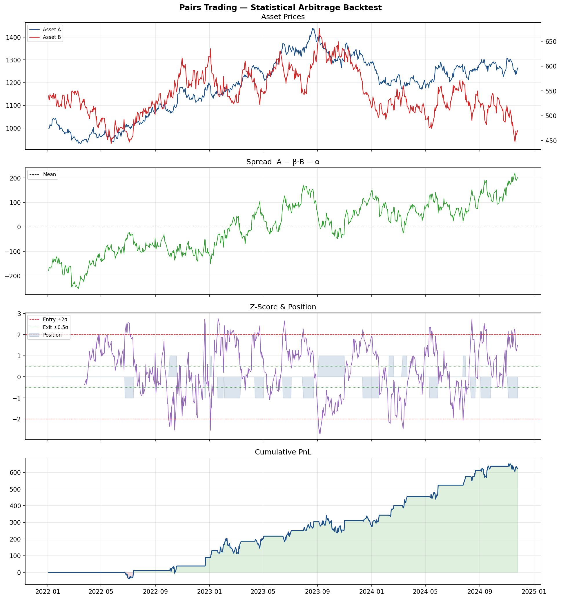

# Pairs Trading — Statistical Arbitrage Backtest

A complete stat-arb pipeline: cointegration testing → hedge ratio estimation → z-score signal generation → vectorised backtest with transaction costs → performance attribution.



## Strategy logic

1. **Cointegration test** (Engle-Granger): verify the spread between two assets is stationary
2. **Hedge ratio** (OLS): estimate β such that `Spread = A − β·B − α` is mean-reverting
3. **ADF test** on the residual spread to confirm stationarity
4. **Z-score signals** on a rolling window:
   - Enter long spread when z < −2σ (A cheap relative to B)
   - Enter short spread when z > +2σ (A expensive relative to B)
   - Exit when |z| < 0.5σ (spread reverted)
5. **Backtest** with one-way transaction costs of 5 bps per leg

## Results (simulated data)

| Metric | Value |
|--------|-------|
| Annualised Sharpe | 1.38 |
| Round trips | 17 |
| Win rate | 54.3% |
| Transaction cost | 5 bps per leg |

## How to run

```bash
pip install -r requirements.txt
python pairs_trading.py
```

## Using real data (DBS / UOB example)

Replace the `generate_pair()` function with:

```python
import yfinance as yf
prices = yf.download(["D05.SI", "U11.SI"], start="2019-01-01", end="2024-01-01")["Close"]
prices.columns = ["Asset_A", "Asset_B"]
prices = prices.dropna()
```

## Key concepts

- **Cointegration ≠ Correlation**: two assets can be highly correlated but non-cointegrated (no stable long-run relationship). Stat-arb requires cointegration.
- **Look-ahead bias**: hedge ratio and rolling window are estimated on in-sample data. For a clean out-of-sample test, split data into train/test.
- **Half-life**: the expected time for the spread to revert halfway to its mean. A short half-life (< 20 days) is desirable for a daily strategy.

## Extensions

- Kalman filter for time-varying hedge ratio
- Ornstein-Uhlenbeck model for optimal entry/exit thresholds
- Portfolio of pairs with cross-sectional risk management
